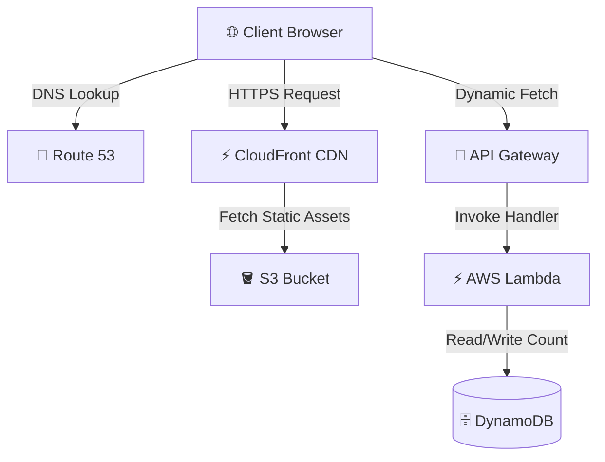
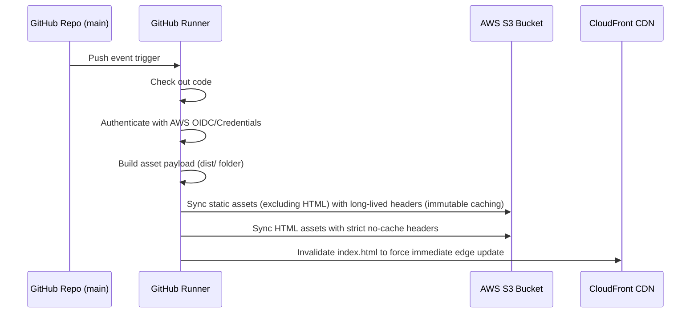

# AWS Cloud Resume Challenge — Frontend

A beautifully styled, high-performance static resume website hosted on AWS, serving as the front-end of the [Cloud Resume Challenge](https://cloudresumechallenge.dev/). This project features a serverless visitor counter, optimized asset delivery via CDN, custom domain routing, and automated CI/CD deployments.

---

## 🏗️ Architecture Overview

The frontend leverages a fully serverless, highly resilient, and cost-optimized architecture on AWS.



### Key Architectural Highlights
1. **Content Delivery Network (CDN)**: Powered by AWS CloudFront, ensuring global low-latency delivery, SSL termination (HTTPS), and edge caching.
2. **Static Web Hosting**: S3 acts as the origin server, maintaining a secure, zero-compute static host for standard assets.
3. **Optimized Asset Pipeline**: Media assets (like the developer's loyal companion 🐶) are offloaded to Cloudinary for real-time image optimization, resizing, and responsive delivery.
4. **Serverless Dynamic Logic**: The website dynamically retrieves and increments a visitor counter using an asynchronous fetch request to an AWS Lambda API endpoint.

---

## 🛠️ Tech Stack

### Frontend & Core Technologies
*   **Structure & Markup**: HTML5
*   **Styling & Layout**: Custom CSS3 (utilizing the `Raleway` and `Roboto Slab` typography families)
*   **Dynamic Client Logic**: Vanilla JavaScript (ES6+ `fetch` API)
*   **Icons & Assets**: Font Awesome 6.7.2

### AWS Infrastructure
*   **Amazon S3**: Hosts static website assets.
*   **Amazon CloudFront**: Distributed global edge-caching and HTTPS delivery.
*   **Amazon Route 53**: Custom domain name registration and DNS routing.
*   **AWS API Gateway & AWS Lambda**: Backend endpoint integration for serverless visitor tracking (Python runtime).
*   **Amazon DynamoDB**: NoSQL database backing the visitor counter.

### DevOps & Integrations
*   **CI/CD Pipeline**: GitHub Actions
*   **Image CDN**: Cloudinary (for real-time image optimization)
*   **Analytics**: Google Analytics (gtag.js)

---

## 📂 Repository Structure

```text
├── .github/
│   └── workflows/
│       └── main.yml        # CI/CD deployment configuration
├── css/
│   └── style.css           # Custom stylesheets & responsive layouts
├── img/
│   └── favicon.png         # Site favicon
├── js/
│   └── resumeCount.js      # Visitor counter client-side handler
├── index.html              # Main resume website
├── error.html              # Custom 404 / error landing page
└── README.md               # You are here
```

---

## 🚀 CI/CD Pipeline & Deployment Strategy

The project employs a robust, fully automated deployment pipeline using **GitHub Actions**. Upon any push to the `main` branch, the pipeline executes the following workflow:



### Cache Control Optimization
To ensure both top-tier performance and instant updates, the deployment workflow implements a split-cache strategy:
*   **Static Assets (CSS, JS, Images)**: Synced with `public,max-age=31536000,immutable`. These assets are cached aggressively by both the CDN and browser since their filenames or paths are immutable during active sessions.
*   **HTML Documents (`index.html`, `error.html`)**: Synced with `no-cache,no-store,must-revalidate`. This tells browsers to always revalidate with S3, ensuring users see resume updates immediately without manually clearing their cache.
*   **CloudFront Invalidation**: An explicit invalidation is run on `/index.html` as the final step of the deployment to purge edge locations.

---

## 💻 Local Development

### Prerequisites
*   A basic local HTTP server (e.g., Python's `http.server`, Node's `http-server`, or the Live Server VS Code extension).

### Running the Webpage Locally
1. Clone the repository:
   ```bash
   git clone https://github.com/t-liu/cloud-resume-challenge-frontend.git
   cd cloud-resume-challenge-frontend
   ```
2. Start a simple web server:
   *   **Using Python 3**:
       ```bash
       python -m http.server 8000
       ```
   *   **Using Node.js**:
       ```bash
       npx http-server -p 8000
       ```
3. Open your browser and navigate to `http://localhost:8000`.

*Note: The visitor counter requires access to the live AWS API Gateway endpoint, which will be fetched dynamically even during local development.*

---

## 🤝 Contributing & Support

Contributions, feedback, and pull requests are always welcome. If you find this codebase helpful or want to discuss integration patterns, feel free to open a PR or reach out via email at [thomas.s.liu@gmail.com](mailto:thomas.s.liu@gmail.com).

To support ongoing serverless hosting fees, the maintenance of this repository, and most importantly, to keep the developer's loyal companion well-fed:

### Support the Developer & His Dog 🐶
Feel free to send support! Every token helps feed the loyal companion:


*“Code is clean, the dog is fed, all is well.”* ヽ(•‿•)ノ
